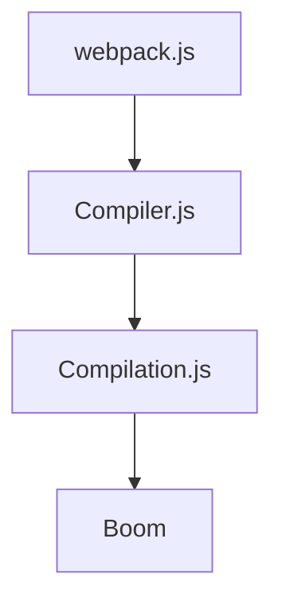

# 🦀 搭建调试环境

测试版本：5.74.0

体验一下：

1. 安装调试工具：`yarn add global ndb`
2. 创建一个调试项目
3. 通过 `npm link` 命令链接本地 Webpack 代码副本
4. 在 Webpack 源码中插入 `debugger` 语句
5. 执行调试命令：`ndb npx webpack`

 

_PS: [ndb](https://www.npmjs.com/package/ndb) 是一个特别简单易用的 NodeJS 代码调试工具，虽然它已经整整 3 年没有更新了 🙄_

